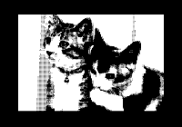

# Sample

  

	
  

  

	<h4 class="card-title">PCG Graphic</h4>
	
Draws full-screen graphics using programmable character generator.

	<a href="pcgraphic" class="btn btn-primary">Detail</a>
  

  

	
  

  

	<h4 class="card-title">MML Sample</h4>
	
Sample programs using MML, music macro language.

	<a href="mml-sample" class="btn btn-primary">Detail</a>
  

